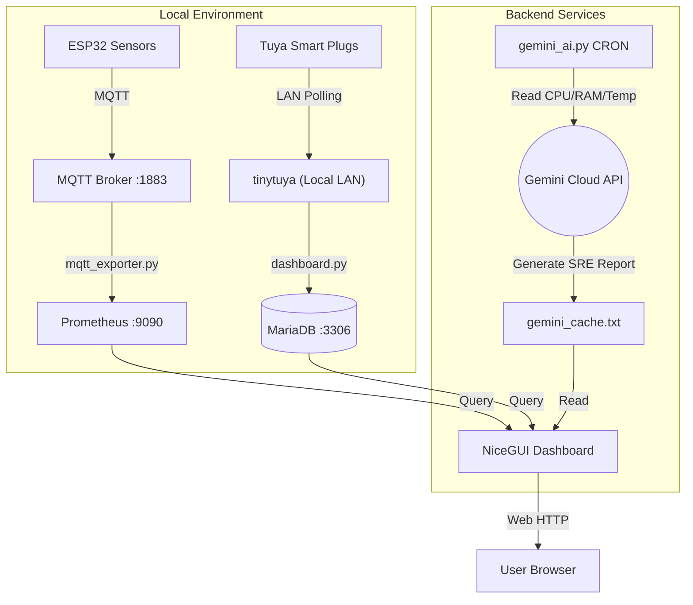

# Homelab Server Dashboard

A real-time monitoring and control system for a self-hosted home server. It provides a live, unified view of hardware health, IoT sensor data, smart plug power consumption, and AI-generated system insights—all bundled in a responsive, modern web UI.

---

## 🌟 Features

The dashboard is built as a sleek Single Page Application (SPA) with three main tabs:

### 1. 🖥️ Server Monitor
Displays live system performance pulled from **Prometheus**:
- **CPU & Core Temp** (via `node_cpu_seconds_total` and `/sys/class/thermal/`)
- **Memory Usage** (used / total GB with a dynamic progress bar)
- **Storage Health** (NVMe SSD & HDD usage and temps)
- **IoT Environmental Sensors** (temperature & humidity from local ESP32 devices via MQTT)
- **DeepMind AI Analysis:** An automated SRE-style health summary powered by Google's `gemini-2.5-flash` API, cached locally and updated every 30 minutes.

### 2. ⚡ Energy Monitor
Tracks real-time and historical power draw from local smart plugs:
- **Live Power Gauge (Watts)**
- **Total Energy Today (kWh)**
- **Estimated Cost** based on TNB (Tenaga Nasional Berhad) Malaysian electricity tariff tiers.
- Integrated historical charts for Daily, Weekly, and Monthly tracking.

### 3. 🔌 Smart Plugs (Tuya Local LAN)
Direct local control and monitoring of Tuya smart plugs without relying on the cloud:
- **LAN Polling:** Uses `tinytuya` to pull sub-second live telemetry (Watts, Volts, Amps).
- **Control:** Toggle power states directly from the dashboard.
- **Safety Measures:** Includes a double-confirm prompt before shutting off the critical "Server" plug to prevent accidental outages.

---

## 🛠️ Tech Stack

- **Frontend / UI:** [NiceGUI](https://nicegui.io/) (Python-based reactive UI)
- **Metrics Backend:** Prometheus + Node Exporter
- **IoT Integration:** ESP32 sensors via MQTT → Prometheus
- **Smart Plug Control:** Tuya Local API (via `tinytuya` over LAN)
- **Database:** MariaDB (storing historical energy telemetry)
- **AI Insights:** Google Gemini API (`gemini-2.5-flash`)
- **Notifications:** Telegram Bot API
- **Process Manager:** PM2 (Node.js process manager)
- **Deployment:** Kubernetes Helm Chart (`/helm`)

---

## 🏗️ Architecture & Data Flow



---

## 🚀 How to Run

### 1. Setup Environment Variables
Create a `.env` file in the project root containing your API credentials. **Never commit this file to version control.**

```env
# Tuya Configuration
TUYA_CLIENT_ID=your_tuya_client_id
TUYA_CLIENT_SECRET=your_tuya_client_secret
TUYA_REGION=sg

# Google Gemini API (AI Insights)
GEMINI_API_KEY=your_gemini_api_key

# Telegram Alerts
TELEGRAM_TOKEN=your_telegram_bot_token
TELEGRAM_CHAT_ID=your_chat_id
```

### 2. Install Dependencies
```bash
python3 -m venv venv
source venv/bin/activate
pip install -r requirements.txt
```

*(Note: Key libraries include `nicegui`, `tinytuya`, `mysql-connector-python`, `prometheus_client`, and `prometheus-api-client`)*

### 3. Start Services with PM2
The project uses `ecosystem.config.js` to manage background Python processes.

```bash
# Start the dashboard, mqtt_exporter, and bot
pm2 start ecosystem.config.js

# Useful PM2 commands
pm2 logs           # View live logs
pm2 status         # Check process health
pm2 restart all    # Restart services
```

By default, the main NiceGUI dashboard is served on **port 3000** (or **8080** locally depending on configuration), and local Prometheus exporters run on ports **2001** and **9324**.

---

## 🎨 UI Development

The project includes a `frontend/dashboard_design.py` file which serves as a sandbox for UI prototyping. It uses dummy data and timers instead of real backend connections, allowing for fast CSS and Flexbox layout iteration without running the full database/Prometheus stack. Production code runs exclusively in `frontend/dashboard.py`.
