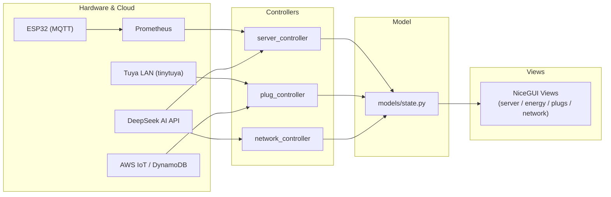

# 🖥️ Homelab Server Dashboard

A real-time monitoring and control system for a self-hosted home server. Built with a clean **MVC architecture** in Python, it provides a unified live view of hardware health, IoT sensor data, smart plug power consumption, network diagnostics, and AI-generated SRE insights — all in a responsive, glassmorphism web UI.

---

## ✨ Features

### 🖥️ Server Monitor
- Live **CPU, Memory, NVMe & HDD** metrics via Prometheus
- **CPU & NVMe temperatures** via `/sys/class/thermal/` and `smartctl`
- **IoT Environmental Sensors** — ESP32 temperature & humidity over MQTT
- **AI SRE Analysis** — DeepSeek-powered health summary, cached and refreshed every 30 minutes

### ⚡ Energy Monitor
- Real-time **wattage, voltage, and current** per smart plug
- **Daily / Weekly / Monthly** energy history charts
- **Estimated cost** calculated against TNB (Malaysian) tiered electricity tariffs

### 🔌 Smart Plugs (Tuya Local LAN)
- Direct **LAN polling** via `tinytuya` — no Tuya cloud dependency
- Toggle power states with a **double-confirm safety prompt** for critical plugs
- Per-plug **live wattage history chart** and fleet overview

### 🌐 Network Monitor
- **Ping probes** to Google DNS, Fast.com, and YouTube — latency, jitter, packet loss
- **Traceroute** on anomaly detection with route-change alerts
- **AI Network Diagnosis** — DeepSeek analyses probe data and identifies internal vs external issues
- **Telegram alerts** on anomaly detection

### ☁️ Cloud Monitor (`/cloud`)
- Mirrors energy readings stored in **AWS DynamoDB**
- Per-device today's summary + last 15 readings table

---

## 🏗️ Architecture

The project follows a strict **MVC (Model-View-Controller)** pattern:

```
Server_Dashboard/
├── app.py                        ← Entry point — wires MVC layers & starts background tasks
│
├── models/
│   └── state.py                  ← Single source of truth (all shared mutable state + constants)
│
├── controllers/
│   ├── server_controller.py      ← Prometheus metrics, AI insights, MQTT publisher
│   ├── plug_controller.py        ← Tuya polling loop, energy cache, toggle commands
│   └── network_controller.py     ← Ping probes, traceroute, AI network diagnosis, Telegram alerts
│
├── views/
│   ├── layout.py                 ← Routes: @ui.page('/') and @ui.page('/cloud')
│   ├── server_view.py            ← Server tab UI
│   ├── energy_view.py            ← Energy tab UI
│   ├── plugs_view.py             ← Plugs tab UI
│   ├── network_view.py           ← Network tab UI
│   └── styles.py                 ← Shared CSS (glassmorphism, dark mode tokens)
│
├── services/
│   ├── db.py                     ← MariaDB queries (energy telemetry, state changes)
│   ├── tuya_local.py             ← tinytuya device config & LAN helpers
│   ├── aws_iot_publisher.py      ← AWS IoT Core / DynamoDB publisher
│   └── cloud_db.py               ← DynamoDB read queries for /cloud page
│
└── backend/
    ├── ai_agent.py               ← DeepSeek AI agent: collects live metrics, generates SRE report
    └── telegram_bot.py           ← Telegram bot: /status and /top commands via ai_agent
```

### Data Flow


```mermaid
flowchart LR
    subgraph Hardware & Cloud
        Prometheus
        TuyaLAN["Tuya LAN (tinytuya)"]
        ESP32["ESP32 (MQTT)"]
        DeepSeek["DeepSeek AI API"]
        AWS["AWS IoT / DynamoDB"]
    end

    subgraph Controllers
        SC["server_controller"]
        PC["plug_controller"]
        NC["network_controller"]
    end

    subgraph Model
        STATE["models/state.py"]
    end

    subgraph Views
        UI["NiceGUI Views\n(server / energy / plugs / network)"]
    end

    Prometheus --> SC
    TuyaLAN --> PC
    ESP32 --> Prometheus
    DeepSeek --> SC & NC
    AWS --> PC

    SC --> STATE
    PC --> STATE
    NC --> STATE
    STATE --> UI
```

---

## 🛠️ Tech Stack

| Layer | Technology |
|---|---|
| **UI Framework** | [NiceGUI](https://nicegui.io/) (Python reactive UI) |
| **Metrics** | Prometheus + Node Exporter |
| **IoT Sensors** | ESP32 → MQTT → Prometheus |
| **Smart Plugs** | Tuya Local LAN (`tinytuya`) |
| **Database** | MariaDB (energy telemetry) |
| **Cloud DB** | AWS DynamoDB |
| **AI Agent** | DeepSeek API (`deepseek-chat`) |
| **Notifications** | Telegram Bot API |
| **Process Manager** | PM2 (`ecosystem.config.js`) |
| **Deployment** | Kubernetes Helm Chart (`/helm`) |

---

## 🚀 Setup & Running

### 1. Environment Variables
Create a `.env` file in the project root. **Do not commit this file.**

```env
# DeepSeek AI
DEEPSEEK_API_KEY=your_deepseek_api_key

# Telegram Alerts
TELEGRAM_BOT_TOKEN=your_telegram_bot_token
TELEGRAM_CHAT_ID=your_chat_id

# Optional: override AI cache file locations (defaults to project root)
AI_CACHE_PATH=/path/to/gemini_cache.txt
NETWORK_AI_CACHE_PATH=/path/to/gemini_network_cache.txt

# Optional: override plug poll interval in seconds (default: 10)
PLUG_POLL_INTERVAL=10
```

### 2. Install Dependencies
```bash
python3 -m venv venv
source venv/bin/activate
pip install -r requirements.txt
```

Key dependencies: `nicegui`, `tinytuya`, `mysql-connector-python`, `prometheus-api-client`, `python-telegram-bot`, `requests`

### 3. Run with PM2
```bash
pm2 start ecosystem.config.js

pm2 logs              # Live logs
pm2 status            # Process health
pm2 restart all       # Restart all services
```

The dashboard runs on **port 3000** by default (override with `PORT=` env var).

### 4. Run Locally (dev)
```bash
python3 app.py
```

---

## 🤖 AI Agent

`backend/ai_agent.py` is the core AI agent. It:
1. Collects live system metrics (CPU %, RAM %, CPU temp, top processes)
2. Sends a structured prompt to the **DeepSeek API**
3. Receives a 4-line SRE-style health summary
4. Caches the result to disk so the dashboard can display it without re-running the LLM

The **Telegram bot** (`backend/telegram_bot.py`) exposes this agent via `/status` and `/top` commands.

---

## 📡 Background Processes (PM2)

| Process | Script | Role |
|---|---|---|
| `homelab-dashboard` | `app.py` | Main NiceGUI web server |
| `mqtt-exporter` | `mqtt/mqtt_exporter.py` | Bridges ESP32 MQTT → Prometheus |
| `homelab-bot` | `backend/telegram_bot.py` | Telegram bot for remote queries |
